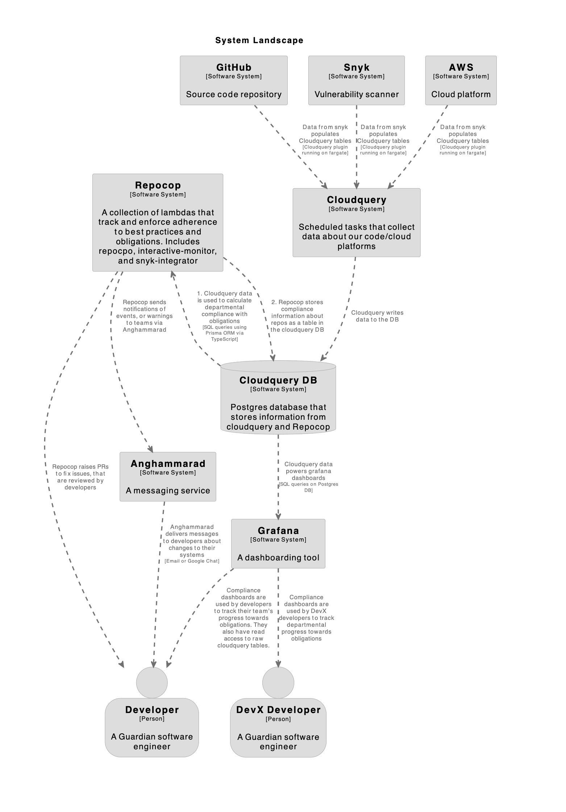

# The Product & Engineering Service Catalogue

A database of information from AWS, GitHub, Synk, and other sources,
Service Catalogue aims to provide a picture of the Guardian's estate, 
broken down by Product & Engineering (P&E) team.

In contrast with [Prism](https://github.com/guardian/prism), which collects data
from a subset of AWS resources, Service Catalogue offers a more complete picture
of production services, as we may provision a resource that Prism doesn't know
about.

## Purpose

The Guardian has hundreds of EC2, lambda, and other services in AWS, 
each built from one of thousands of GitHub repositories, 
by one of many P&E teams.

Some of the questions Service Catalogue aims to answer include:
- For P&E teams:
  - Which services do I own?
  - Which services follow DevX best practice/use tooling?
  - Which repo do services come from?
  - What is my service reliability? (time since last incident)
- For the Developer Experience stream:
  - What proportion of all services follow best practice/use tooling?
  - What kinds of technologies are different streams using?
  - Which teams are struggling with reliability and need more support?
  - Which services belong to specific P&E product teams

Pricing information is not yet available in Service Catalogue,
therefore, we're unable to answer questions such as:
- What does each service cost?
- What services are costing us the most money?

## How does it work?

Service Catalogue has two parts:
1. Data collection
2. Data analysis

### Data collection

We use [CloudQuery](https://www.cloudquery.io/) to collect data from AWS, GitHub, Snyk, and other sources.

We've implemented CloudQuery as a set of ECS tasks, writing to a Postgres database.
For more details, see [CloudQuery implementation](docs/cloudquery-implementation.md).

> [!TIP]
> To update CloudQuery, see [Updating CloudQuery](docs/updating-cloudquery.md).

### Data analysis

The data in Service Catalogue is analysed in two ways:
1. Grafana, at https://metrics.gutools.co.uk
2. AWS Lambda functions, for example [RepoCop](packages/repocop) or [data-audit](packages/data-audit)

## How to run locally

Follow the instruction in the dev-environment [README](packages/dev-environment/README.md) to run cloudquery locally.
Then follow the instructions in the repocop [README](packages/repocop/README.md) to run repocop locally.

## Architecture

The diagram below outlines the architecture of the major components of the service catalogue. For more detailed diagrams of particular components, see the [diagrams folder](./diagrams/) or the respective project READMEs

