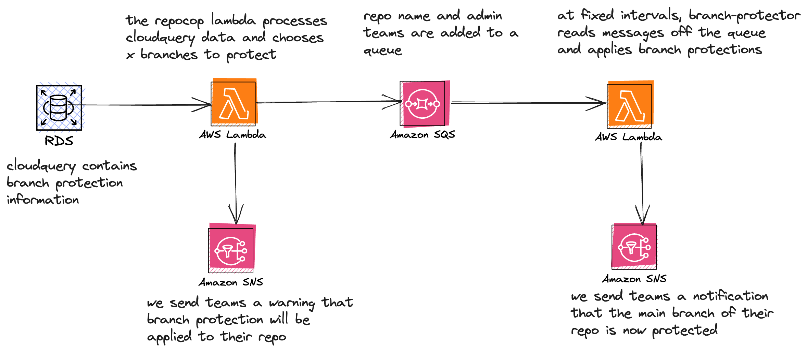

## Branch Protector

This lambda applies branch protection to repos that are passed to it via an SQS topic.

Input looks like this:

```json
{
	"full_name": "guardian/repo1",
	"admin_slugs": ["team1", "team2"]
}
```

It will apply the following protections:

- All status checks must pass before merging
- Approval is required from one person who must be a member of at least one of the teams enumerated in the `admin_slugs`

### Architecture of branch protector


