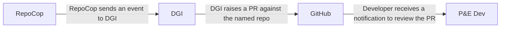
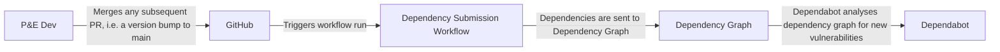

## Dependency graph integrator

### Context

#### Why track dependencies?

The supply chain is an increasingly common attack vector for malicious actors. Tracking the dependencies we use - and resolving the vulnerabilities they introduce - allows us to minimise the probability of such an attack occurring, and the reduces the impact of such an attack.

#### Why do we need this tool?

Dependency management is a complex problem, and no tool is a complete solution. Dependabot (GitHub's in-house dependency management tool) works well for some languages, but not all. Crucially for P&E, Dependabot does not support scanning build.sbt files, and some Kotlin configurations. This tool attempts to solve that problem.

An automated solution saves teams time and effort expended into understanding how to configure the action, and means repos are integrated with Dependabot more quickly, and with fewer mistakes.

### What does it do?

The dependency graph integrator takes a repo name as JSON, like so:

```json
{
	"name": "service-catalogue",
	"language": "Scala",
	"admins": ["my-team-slug"]
}
```

It uses this input to generate a workflow file that allows us to submit sbt or Gradle dependencies to GitHub for vulnerability monitoring via a GitHub Action.

For a Scala repo, the file will look something like this:

```yaml
name: Update Dependency Graph for sbt
on:
  push:
    branches:
      - main
      - branch # temporary branch created for initial validation
  workflow_dispatch:
jobs:
  dependency-graph:
    runs-on: ubuntu-latest
    permissions:
      contents: write # this permission is needed to submit the dependency graph
    steps:
      - name: Checkout branch
        uses: actions/checkout@<commit> # vX.Y.Z
      - name: Set up Java
        uses: actions/setup-java@<commit> # vX.Y.Z
        with:
          distribution: temurin
          java-version: 21
      - name: Install sbt
        id: sbt
        uses: sbt/setup-sbt@<commit> # vX.Y.Z
      - name: Submit dependencies
        id: submit
        uses: scalacenter/sbt-dependency-submission@<commit> # vX.Y.Z
      - name: Log snapshot for user validation
        id: validate
        run: cat ${{ steps.submit.outputs.snapshot-json-path }} | jq
```

After creating the YAML file, it raises a pull request on the named repository for teams to review. If admins are provided, the PR will automatically request team review from those GitHub team slugs.

On PROD, the lambda first enables Dependabot vulnerability alerts on the repository, and then raises the PR. If enabling alerts fails, the PR is not created. The process looks like this (Dependency Graph Integrator has been abbreviated to DGI):



### Running on non-production environments

In non-production environments, such as CODE, or when running locally, the dependency graph integrator will not create a PR. Instead, it will print the contents of the YAML file to the console. This allows developers to test the core logic (creating the yaml file), without unintended side effects.

#### CODE

The lambda can safely be invoked in the CODE environment, as it will only attempt to create a PR if the `STAGE` environment variable is set to `PROD`. Additionally, there are no GitHub credentials available to the CODE lambda - any attempt to instantiate a GitHub client will fail.

The format of input to the lambda on the CODE environment is that of an SNS message. It's not trivial to construct, so some sample events have been provided in the Test tab of the lambda in the AWS console.

#### DEV

### Testing and snapshot updates

The lambda can be invoked locally by running `npm run start -w dependency-graph-integrator` from the root of the repo, or `npm run start` from the root of the dependency-graph-integrator package.

You can preview the generated YAML and PR body locally by setting the language in [`run-locally.ts`](./src/run-locally.ts). This controls which workflow template is used:

- Scala → sbt workflow
- Kotlin → Gradle workflow

Example:

```ts
if (isMain) {
	void main({
		name: 'service-catalogue', // repo name
		language: 'Scala', // 'Scala' or 'Kotlin'
		admins: ['my-team-slug'], // optional, use [] if none
	});
}
```

The package uses snapshot tests to verify the generated workflow YAML and PR body formatting.

- Run tests:
  - `npm test -w dependency-graph-integrator`
- Update snapshots (accept intentional changes):
  - `npm test -w dependency-graph-integrator -- -u`
  - or `npm run -w dependency-graph-integrator test:update`

Snapshots are stored in:

- `packages/dependency-graph-integrator/src/__snapshots__/*.snap`

When to update:

- After Dependabot bumps Action commit hashes or version comments in the template.
- When you intentionally change the generator output (structure, comments, ordering).

Workflow:

- If tests fail due to snapshot differences, review the diff, then re-run with `test -- -u` flag (or `test:update`) to accept the changes.

#### Why a custom test runner in this package?

This package uses a small wrapper script (`scripts/test-runner.mjs`) around Node’s built‑in test runner to essentially set `UPDATE_SNAPSHOTS=true` when `-u` is passed, standardising snapshot updates locally and in CI. This enables developers and CI to use the same simple commands without manually managing environment variables or flags, reducing configuration drift and mistakes.

### How does dependency submission work once the action is in use?


