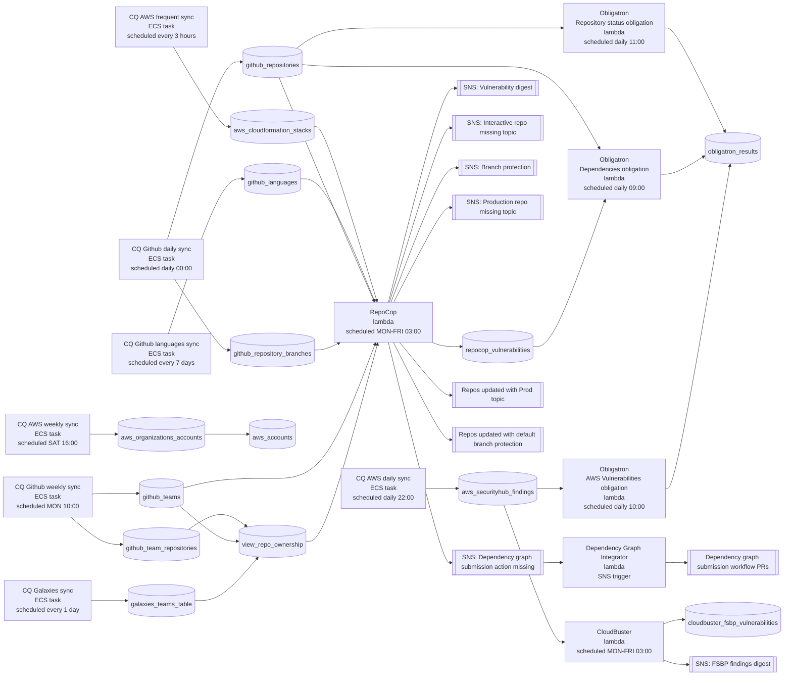

# Job Dependencies

This diagram shows the flow of data and dependencies that RepoCop relies on as well as the downstream events that rely
on RepoCop.

```mermaid
flowchart LR
    %% Data stores
    awsAccountData[(aws_organizations_accounts)]
    awsStackData[(aws_cloudformation_stacks)]
    awsFsbpFindingData[(aws_securityhub_findings)]
    ghLangData[(github_languages)]
    ghRepoData[(github_repositories)]
    ghBranchData[(github_repository_branches)]
    ghTeamData[(github_teams)]
    ghTeamRepoData[(github_team_repositories)]
    galaxyTeamData[(galaxies_teams_table)]
    repoCopVulnData[(repocop_vulnerabilities)]
    fsbpVulnData[(cloudbuster_fsbp_vulnerabilities)]
    obligatronResultData[(obligatron_results)]

    %% Data views
    awsAccountView[(aws_accounts)]
    repoOwnerView[(view_repo_ownership)]

    %% Notifications
    vulnNotice[[SNS: Vulnerability digest]]
    fsbpNotice[[SNS: FSBP findings digest]]
    ghInteractiveRepoNotice[[SNS: Interactive repo missing topic]]
    ghBranchProtectNotice[[SNS: Branch protection]]
    ghProdRepoNotice[[SNS: Production repo missing topic]]
    ghDepGraphMissingNotice[[SNS: Dependency graph submission action missing]]

    %% Other writes
    ghDepGraphPR[[Dependency graph submission workflow PRs]]
    ghProdRepo[[Repos updated with Prod topic]]
    ghBranchProtect[[Repos updated with default branch protection]]

    %% Processes
    awsWeeklyLoader[CQ AWS weekly sync<br>ECS task<br>scheduled SAT 16:00]
    awsDailyLoader[CQ AWS daily sync<br>ECS task<br>scheduled daily 22:00]
    awsFreqLoader[CQ AWS frequent sync<br>ECS task<br>scheduled every 3 hours]
    ghWeeklyLoader[CQ Github weekly sync<br>ECS task<br>scheduled MON 10:00]
    ghDailyLoader[CQ Github daily sync<br>ECS task<br>scheduled daily 00:00]
    ghLangLoader[CQ Github languages sync<br>ECS task<br>scheduled every 7 days]
    galaxiesLoader[CQ Galaxies sync<br>ECS task<br>scheduled every 1 day]
    repocop[RepoCop<br>lambda<br>scheduled MON-FRI 03:00]
    depGraphIntegrator[Dependency Graph Integrator<br>lambda<br>SNS trigger]
    cloudbuster[CloudBuster<br>lambda<br>scheduled MON-FRI 03:00]
    obligatronDeps[Obligatron<br>Dependencies obligation<br>lambda<br>scheduled daily 09:00]
    obligatronVulns[Obligatron<br>AWS Vulnerabilities obligation<br>lambda<br>scheduled daily 10:00]
    obligatronRepoStatus[Obligatron<br>Repository status obligation<br>lambda<br>scheduled daily 11:00]

    %% Dependencies

    %% Data loading
    awsWeeklyLoader --> awsAccountData
    awsFreqLoader --> awsStackData
    awsDailyLoader --> awsFsbpFindingData
    ghLangLoader --> ghLangData
    ghDailyLoader --> ghRepoData
    ghDailyLoader --> ghBranchData
    ghWeeklyLoader --> ghTeamData
    ghWeeklyLoader --> ghTeamRepoData
    galaxiesLoader --> galaxyTeamData
    awsAccountData --> awsAccountView
    ghTeamRepoData --> repoOwnerView
    ghTeamData --> repoOwnerView
    galaxyTeamData --> repoOwnerView

    %% RepoCop
    awsStackData --> repocop
    ghLangData --> repocop
    ghRepoData --> repocop
    ghBranchData --> repocop
    ghTeamData --> repocop
    repoOwnerView --> repocop
    repocop --> repoCopVulnData
    repocop --> ghDepGraphMissingNotice
    repocop --> ghInteractiveRepoNotice
    repocop --> ghBranchProtectNotice
    repocop --> ghBranchProtect
    repocop --> vulnNotice
    repocop --> ghProdRepoNotice
    repocop --> ghProdRepo

    %% Dependency graph integrator
    ghDepGraphMissingNotice --> depGraphIntegrator
    depGraphIntegrator --> ghDepGraphPR

    %% Cloud Buster
    awsFsbpFindingData --> cloudbuster
    cloudbuster --> fsbpVulnData
    cloudbuster --> fsbpNotice

    %% Obligatron
    ghRepoData --> obligatronRepoStatus
    obligatronRepoStatus --> obligatronResultData
    ghRepoData --> obligatronDeps
    repoCopVulnData --> obligatronDeps
    obligatronDeps --> obligatronResultData
    awsFsbpFindingData --> obligatronVulns
    obligatronVulns --> obligatronResultData
```
