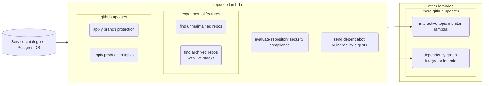

# RepoCop

RepoCop is a tool to help us discover and apply best practices and security obligations across our estate. In particular, it's concerned with the security of our GitHub repositories.
It is deployed as an AWS Lambda, and powers:

- The [Dependency Vulnerability dashboard](https://metrics.gutools.co.uk/d/fdib3p8l85jwgd)
- The [Best Practices Compliance dashboard](https://metrics.gutools.co.uk/d/EOPnljWIz)
- Team vulnerability digests
- The [interactive-monitor](../interactive-monitor/README.md) lambda
- The [dependency-graph-integrator](../dependency-graph-integrator/README.md) lambda

See the [job dependencies diagram](JobDependencies.md).

## Running RepoCop locally

From the root of the repo:

1. Connect to the VPN (even in the office)
2. Retrieve Deploy Tools credentials
3. Run the setup script (only if running for the first time, or for the first time in a while)
4. Create a local [CloudQuery](../dev-environment/README.md) database by running `npm run start -w dev-environment`, and wait for the tables to be populated (this will take a few minutes)
5. Run repocop using `npm -w repocop start`

## Running RepoCop on AWS

The CODE Repocop lambda can safely be executed from the AWS console. This is because it doesn't have any `write` level GitHub permissions, and the functionality that sends messages to dev teams sits behind a stage-based feature flag, making it quite difficult to disrupt teams with false alarms. RepoCop's downstream lambdas also do not have the ability to make any changes to GitHub, and generally don't have any GitHub permissions at all on CODE. It will instead log the messages that it would have sent.

## How to write DB queries in RepoCop

There are lots of ways of writing/making queries to the database, depending on what you want to optimise for. To support a more functional code style, we have chosen to minimise the number of side-effecting DB calls, and pushed them as close to the edge of the lamda as possible (i.e. only making calls to the database at the very beginning, and at the very end of the lambda). This is slightly more memory intensive than making DB calls as and when we need them, but has a few advantages. These are:

- Fewer side effects make the code easier to reason about.
- Writing in a functional style is easier, so unit testing of business logic can be more comprehensive, requiring less mocking.
- If there are any issues connecting to the database, or even just a particular table, the lambda will fail quickly, wasting less time.

Our guidelines for DB calls in RepoCop are:

1. Only make one call to the database per table
2. Make all calls to the database at the beginning or end of the lambda
3. To reduce memory usage, when creating the query function, only select the columns you need. You can always come back later and select more if you need them.
4. When retrieving rows from the database, try not to do anything more complicated than a simple WHERE clause (for example, don't try to join two tables in one prisma query). Any complex logic should be handled by a unit-tested function.
