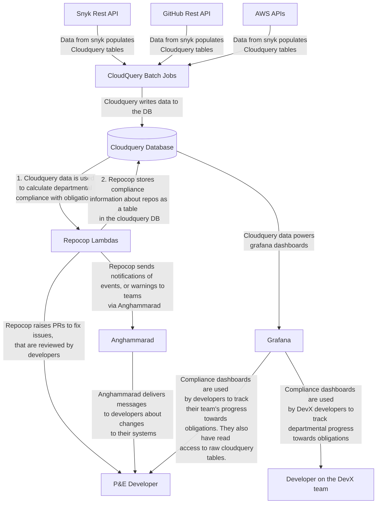

# RepoCop

RepoCop is a tool to help us discover and apply best practices across our estate.
It is deployed as an AWS Lambda.

See the [Grafana dashboard](https://metrics.gutools.co.uk/d/2uaV8PiIz/repocop?orgId=1) for a definition of the rules and how they are met.

## Running RepoCop locally

Prerequisites:

1. [CloudQuery](../dev-environment/README.md) has populated the local database
2. The prisma migrations have been applied to the local database

```bash
npm -w cli start migrate -- --stage DEV
```

To run RepoCop locally, run:

```bash
npm -w repocop start
```

## How to interact with the database

There are lots of ways of writing/making queries to the database, depending on what you want to optimise for. If you are optimising for memory usage, you might want to make lots of highly targeted queries in each function so objects are small and short lived. We have chosen an approach that minimises side effecting calls, and tries to make them all at the beginning or the end of the lambda. This makes it easier to reason about, and test the code, and if there are any issues connecting to the database, or a particular table, it will fail quickly, wasting the fewest amount of resources.

Our guidelines for interacting with the database are:

1. Only make one call to the database per table
2. Make all calls to the database at the beginning or end of the lambda
3. To reduce memory usage, when creating the query function, only select the columns you need. You can always come back later and select more if you need them.

## Architecture


